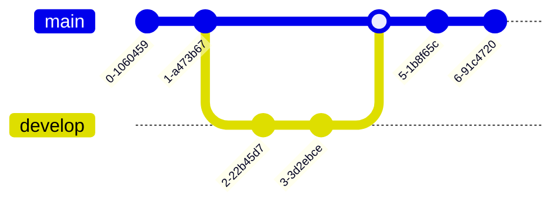

# Diagrams

_Describe the **semantics** — Mermaid renders the shape_

- flowchart, sequence, class, state
- gitGraph, ER, Gantt, mindmap, timeline...

[Mermaid](https://mermaid.js.org) · [D2](https://d2lang.com) · [C4](https://c4model.com) · [diagrams.py](https://diagrams.mingrammer.com)

