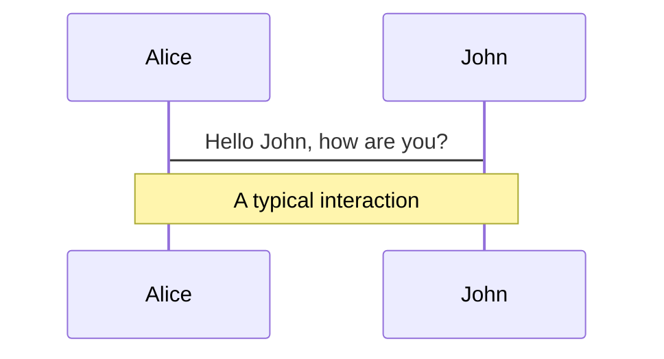
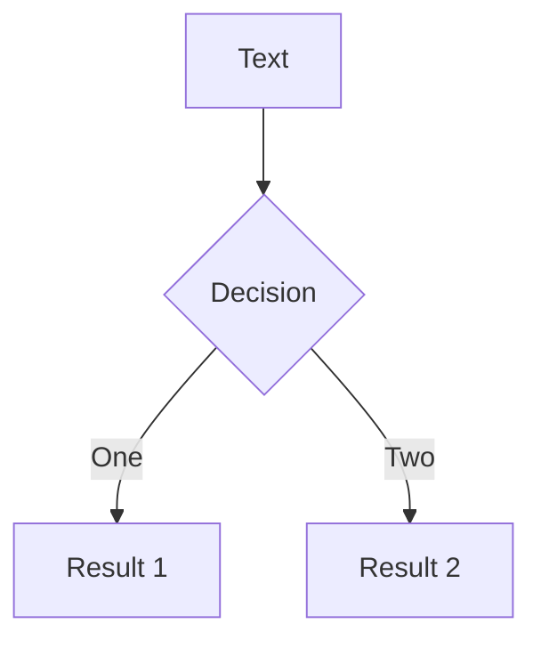
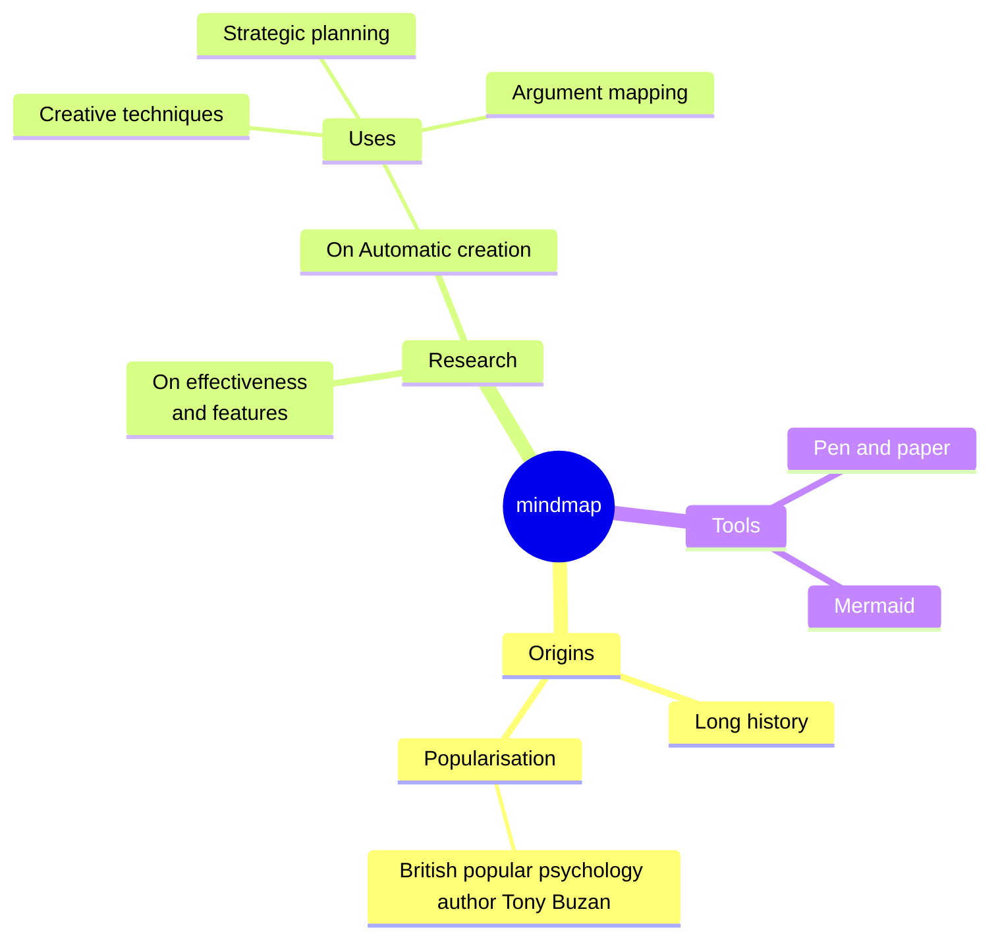
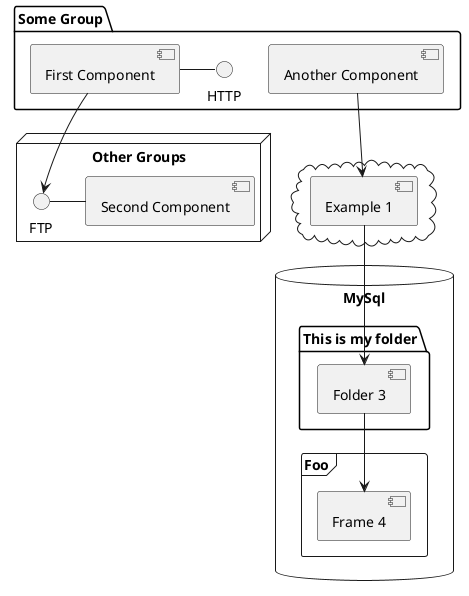

---
# You can also start simply with 'default'
theme: dracula
# some information about your slides (markdown enabled)
title: Welcome to RD Slides
info: Learn more at [Rafail.dev](https://t.me/rafail_dev)
lineNumbers: true

# slide transition: https://sli.dev/guide/animations.html#slide-transitions
transition: slide-left

defaults:
  layout: center
  class: text-center

layout: image
image: /zeon-intro.jpg
backgroundSize: contain
# enable MDC Syntax: https://sli.dev/features/mdc
mdc: true
# duration of the presentation
duration: 35min
---

---

# Welcome to Slidev

Presentation slides for developers

  Press Space for next page <carbon:arrow-right />

  <button @click="$slidev.nav.openInEditor()" title="Open in Editor" class="slidev-icon-btn">
    <carbon:edit />
  </button>
  <a href="https://github.com/slidevjs/slidev" target="_blank" class="slidev-icon-btn">
    <carbon:logo-github />
  </a>

---
src: ./pages/as-code.md
---

---

# Markup of the previous slide

<<< @/pages/as-code.md#snippet

<v-click>

_Not a copy — both slides reference the same file_

(<<< @/pages/as-code.md#snippet)

</v-click>

---
src: ./pages/tools.md
---

---
src: ./pages/slidev.md
---

---
src: ./pages/diagrams.md
---

---

# Diagrams

You can create diagrams / graphs from textual descriptions, directly in your Markdown.

Learn more: [Mermaid Diagrams](https://sli.dev/features/mermaid) and [PlantUML Diagrams](https://sli.dev/features/plantuml)

---
layout: center
class: text-center
---

# Learn More

[Documentation](https://sli.dev) · [GitHub](https://github.com/slidevjs/slidev) · [Showcases](https://sli.dev/resources/showcases)

<PoweredBySlidev mt-10 />
